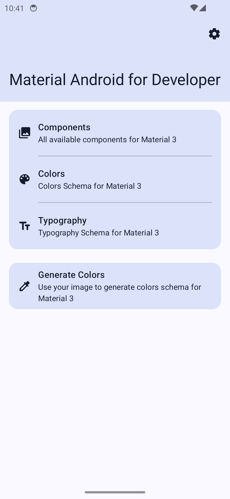
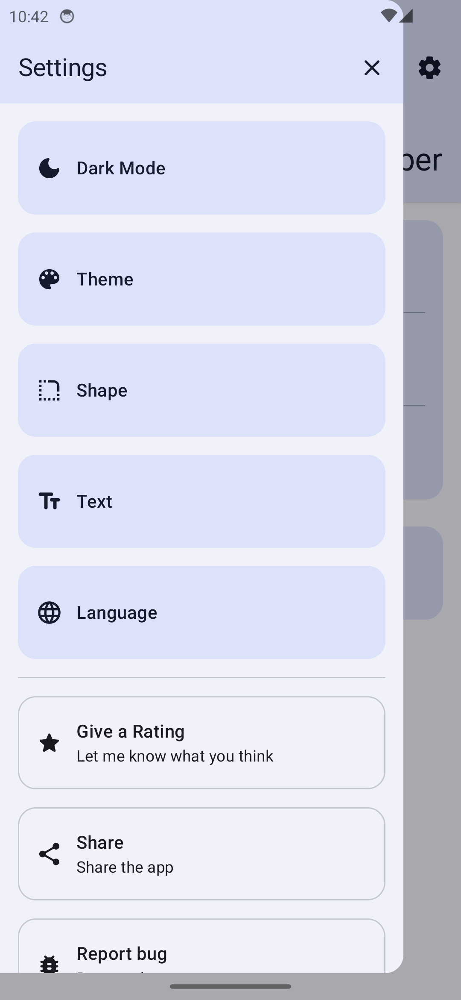
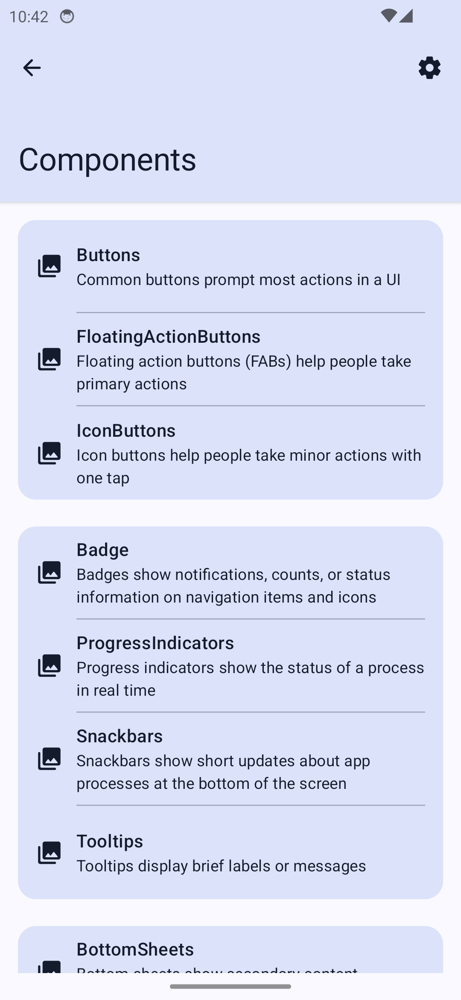
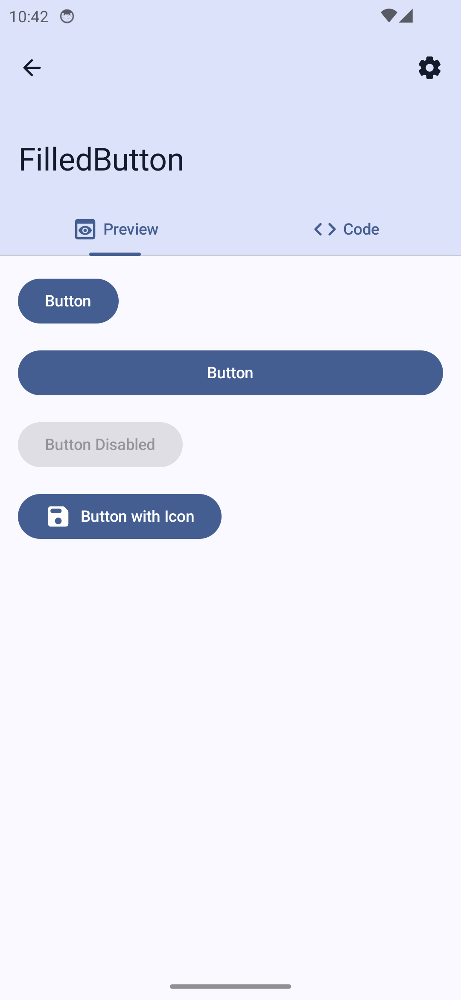
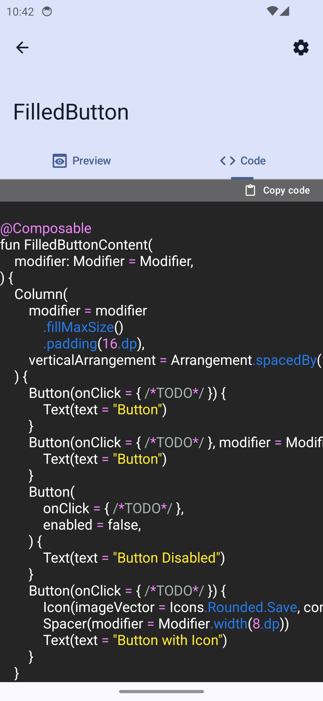
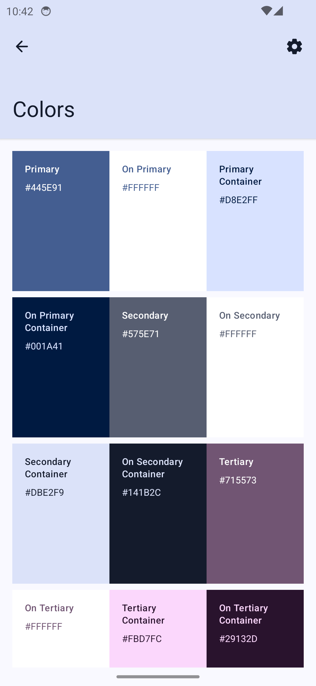
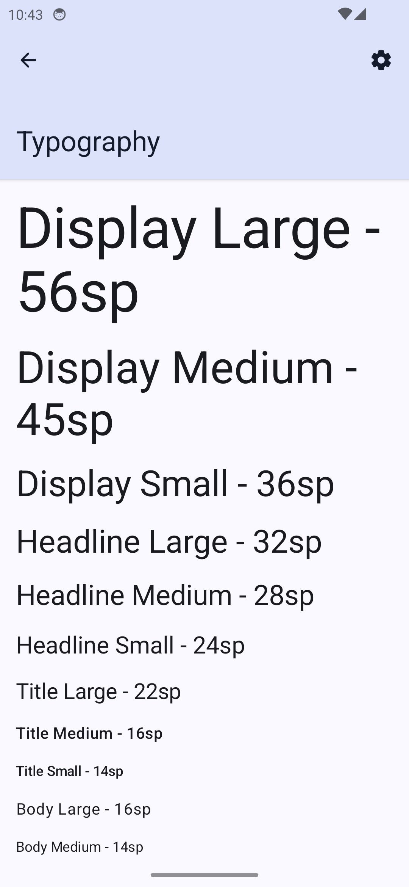
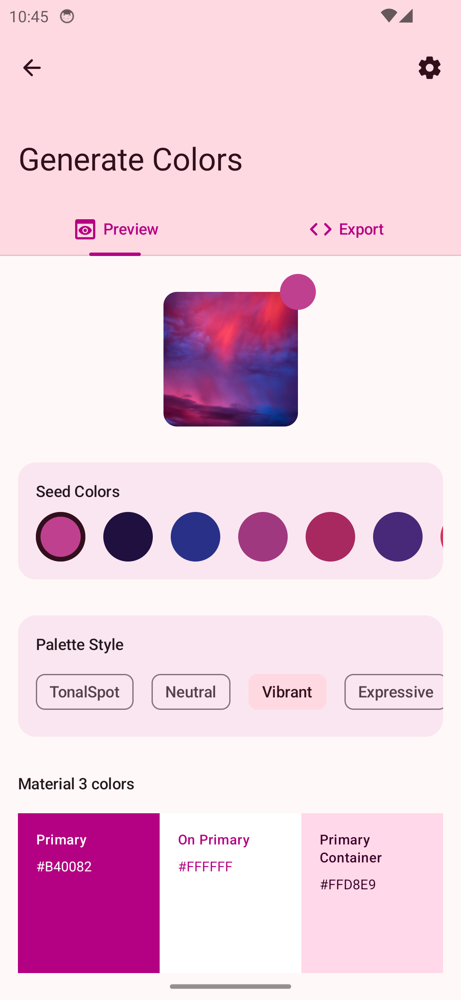

# ✨ Material Android For Developers (MAFD)

<p align="center" width="100%">

</p>

Material Android For Developers (MAFD) allows you to explore all components currently supported by Compose Material 3, side by side with the code. Additionally, you can generate color schemes based on a given image.

## 📸 Screenshot

<p align="start" width="100%">
  
  
  
  
  
  
  
  
</p>

## 👉 Download the App

Download it on this [page](https://github.com/bayu07750/MaterialAndroidForDevelopers/releases/tag/v0.0.1).

## 🚧 Status

The app is still in its early stages of development, and many changes may occur in the future. However, I am currently satisfied with its functionality.

## ✨ Features

- Browse all components currently supported by Compose Material 3.
- View source code with syntax highlighting.
- Copy the code.
- Generate Material 3 color schemes based on a given image.
- Customization options:
- Dark theme support
- Change theme
- Modify shape
- Change font family
- Support for other languages
- Survive configuration changes

## 🛠️ Tech Stack

- [Kotlin](https://github.com/JetBrains/kotlin) - The Kotlin Programming Language.
- [Jetpack Compose](https://developer.android.com/develop/ui/compose) - Jetpack Compose is Android’s recommended modern toolkit for building native UI. It simplifies and accelerates UI development on Android. Quickly bring your app to life with less code, powerful tools, and intuitive Kotlin APIs.
- [Data Store](https://developer.android.com/topic/libraries/architecture/datastore) - Jetpack DataStore is a data storage solution that allows you to store key-value pairs.
- [Material Kolor](https://github.com/jordond/MaterialKolor) - 🎨 A Compose multiplatform library for generating dynamic Material3 color schemes from a seed color.
- [Landscript](https://github.com/skydoves/landscapist) - 🌻 A pluggable, highly optimized Jetpack Compose and Kotlin Multiplatform image loading library that fetches and displays network images with Glide, Coil, and Fresco.
- [Kotlinx Serialization](https://github.com/Kotlin/kotlinx.serialization) - Kotlin multiplatform / multi-format serialization  .
- [Kotlinx Collections Immutable](https://github.com/Kotlin/kotlinx.collections.immutable) - Immutable persistent collections for Kotlin.
- [AboutLibraries](https://github.com/mikepenz/AboutLibraries) - AboutLibraries automatically collects all dependencies and licenses of any gradle project (Kotlin MultiPlatform), and provides easy to integrate UI components for Android and Compose-jb environments.
- [Dagger-hilt](https://github.com/google/dagger/) - A fast dependency injector for Android and Java.
- [Timber](https://github.com/JakeWharton/timber) - A logger with a small, extensible API which provides utility on top of Android's normal Log class.
- [Firebase](https://firebase.google.com/).

## 👷🏽Building

First, you need Android Studio Jellyfish or a higher version. You can download Android Studio [here](https://developer.android.com/studio).

Clone this repository or download it as a zip file, then open it in Android Studio.

### Baseline Profiles

The project uses [Baseline profiles](https://developer.android.com/topic/performance/baselineprofiles/overview) - Baseline Profiles improve code execution speed by about 30% from the first launch by avoiding interpretation and just-in-time (JIT) compilation steps for included code paths.

To generate baseline profiles, you need to change the build type to `nonMinifiedRelease` in the `:app` module.

<p align="start" width="100%">
  
</p>

Then, run the following Gradle script in the terminal: `./gradlew app:generateReleaseBaselineProfile`.

The output file from generating baseline profiles can be found at `/app/src/release/generated/baselineProfiles`.

### Source code generator

To generate Material 3 component source as a String, you need to install NodeJS - NodeJS is a JavaScript runtime that allows you to run JavaScript code outside the browser. You can download Node [here](https://nodejs.org/), or if you are using a Mac, you can easily install NodeJS by running `brew install node` in the terminal.

Then, to check that NodeJS is installed, run this script: `node --version`.

To generate source code as a `String`, run the following script: `node source_code_generator.js`.

#### Example

Input
```kt
/* region */
@Composable
fun FilledButtonContent(
    modifier: Modifier = Modifier,
) {
    Button(onClick = { /*TODO*/ }) {
        Text(text = "Button")
    }
}
/* endregion */
```

Output
```kt
object FilledButtonContentSourceCode {
 
     val code get() = """
@Composable
fun FilledButtonContent(
    modifier: Modifier = Modifier,
) {
  Button(onClick = { /*TODO*/ }) {
    Text(text = "Button")
  }
}
     """.trimIndent()
}
```
